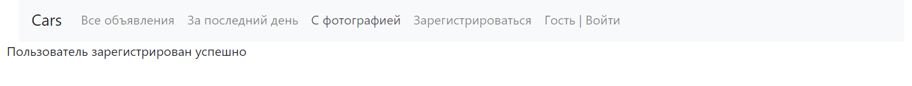

# job4j_cars

## Описание проекта
Данный проект представляет собой реализацию сайта по продаже автомобилей.  
Реализованный функционал:
* 3 списка объявлений автомобилей: все объявления, объявления за последние сутки, объявления с фото;
* зарегистрированные пользователи могут просматривать подробную информацию по объявлениям и создавать свои;
* если объявление не закрыто, то создатель может его отредактировать, закрыть или удалить;
* если объявление закрыто, то создатель может его только удалить.

## Стек технологий
* Java 17
* PostgreSQL 14
* Apache Maven 3.8.5
* Spring Boot 2.7.3
* Liquibase 4.15.0
* Hibernate 5.6.11.Final;
* Log4j 1.2.17
* Lombok 1.18.24
* JUnit 5.8.2
* Mockito 4.8.0
* Checkstyle 8.29
* Thymeleaf 3.0.15

## Требуемое окружение для запуска проекта
* Браузер
* JDK 17
* Apache Maven 3.8
* PostgreSQL 14

## Инструкция по запуску проекта
### Используя Docker – выполнить команды
1)  `git clone https://github.com/denfort50/job4j_cars`
2) `cd job4j_cars`
3) `mvn install`
4) `docker build -t job4j_cars .`
5) `docker-compose up`

### Не используя Docker
1) Скачать и разархивировать проект
2) В PostgreSQL создать базу данных cinema (url = `jdbc:postgresql://127.0.0.1:5432/cars`)
3) Открыть командную строку и перейти в папку с проектом, например `cd c:\projects\job4j_cars`
4) Выполнить команду `mvn install`
5) Перейти в папку target командой `cd target`
6) Выполнить команду `java -jar job4j_cars-1.0.jar`
7) Перейти по ссылке `http://localhost:8081/posts`

## Взаимодействие с приложением

### При открытии сайта попадаем на страницу для авторизации

### Если учетная запись не найдена, то будет выведено сообщение

### Если учетной записи ещё нет, то необходимо зарегистрироваться

### Если регистрация прошла успешно, то будет выведено сообщение

### После успешной аутентификации попадаем на страницу со списком всех объявлений

### Страница с формой добавления объявления

### Страница с формой редактирования объявления

### Если объявление не закрыто, то на странице с подробной информацией высвечивается 3 кнопки: "Завершить продажу", "Отредактировать описание", "Удалить объявление"

### Если объявление закрыто, то на странице с подробной информацией только кнопка "Удалить объявление"

## Контакты для связи
&nbsp;&nbsp;
&nbsp;&nbsp;

